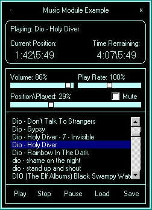



## Music Module v2\.2 Final with Example

### Description

Easily create a mp3, wav, midi, ect. music player. Has support for saving and loading .m3u playlist.

Has added support for changing the volume, panning, and mute. Increase or decrease the playing rate.

Plus much more. Did a alittle tweaking to the code also. I added a basic example of how to use the class module.

If you have any questions email me at: elitecobra@hotmail.com. Can visit my website at: www16.brinkster.com/codesource.

Please vote if you like and leave feedback. Want more features or have suggestions? Let me know.
 
### More Info
 

             |
---                |---
**Submitted On**   |2002-03-01 19:50:54
**By**             |[Jason Hensley](https://github.com/Planet-Source-Code/PSCIndex/blob/master/ByAuthor/jason-hensley.md)
**Level**          |Beginner
**User Rating**    |4.6 (41 globes from 9 users)
**Compatibility**  |VB 4\.0 \(32\-bit\), VB 5\.0, VB 6\.0
**Category**       |[Sound/MP3](https://github.com/Planet-Source-Code/PSCIndex/blob/master/ByCategory/sound-mp3__1-45.md)
**World**          |[Visual Basic](https://github.com/Planet-Source-Code/PSCIndex/blob/master/ByWorld/visual-basic.md)
**Archive File**   |[Music\_Modu58701312002\.zip](https://github.com/Planet-Source-Code/jason-hensley-music-module-v2-2-final-with-example__1-32244/archive/master.zip)

